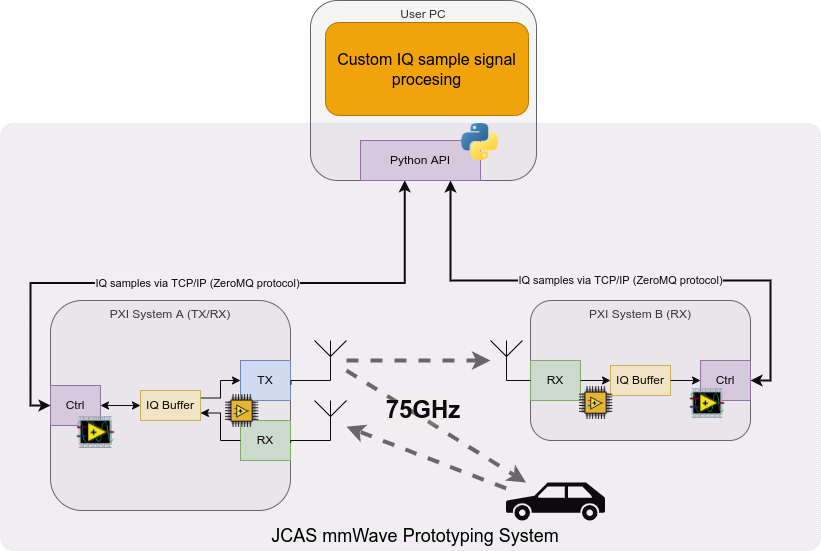

# Millimeter Wave System for Joint Communication and Sensing Research

This repository contains source code and documentation to use the National Instruments PXI platform with mmWave Radioheads as a research platform for joint communication and sensing (JCAS) in the 75GHz domain.

## Overview
### Challenge
Research for joint communication and sensing (JCAS) cannot stop at the algorithm design or simulation stage.

Instead, algorithms need to be tested with real hardware in realistic environments.

Bridging this gap between theory and practice is especially difficult in the mmWave domain, where real-time implementations for high signal bandwidths demand significant FPGA skillsets and high carrier frequencies demand appropriate frontends.

Therefore, it is absolutely necessary to evaluate diverse algorithms with real-world data from realistic environments in an offline fashion.

The present system allows researchers to quickly evaluate signal processing algorithms in the mmWave domain and switch quickly between simulated and real hardware.

### Solution
The solution comprises two units, where "System A" is equipped with a transmitter and receiver and acts as the radar emitter and receiver. "System B" performs reception only and hence acts as the communication receiver.

The solution allows to precalculate transmitter IQ samples in an offline fashion and upload these samples over a network interface into the radar emitter. Then, the transmitter emits these IQ samples with a sample rate of 3.072GHz, and at the same time, the receivers of both System A and B record the received signals. Afterwards, the recorded samples can be downloaded via the network interface to be further processed offline.

This repository contains a Python library which allows to transparently interact with the system as a black box over the network and use it to replay and record signals. The library can be easily integrated as an alternative channel model into existing simulation chains, like the HermesPy simulator project to easily switch between simulation and real-world testing.



## Hardware dependencies
The present setup has been developed and tested with a system containing of the following hardware components:

- System A:
  - NI PXIe-1085 PXI chassis
  - NI PXIEe-8880, Win 10, with 8GB RAM Upgrade
  - NI PXIe-3610 Baseband generator
  - NI PXIe-3620 IQ (de)modulator
  - NI PXIe-3630 Baseband digitizer
  - 2x NI PXIe-7902 High-Speed Serial Module
  - NI PXIe-6592R High-Speed Serial Module
  - NI PXIe-6674T Synchronization module
  - NI MMRH-3657 71-76GHz mmWave Downconverter
  - NI MMRH-3647 71-76GHz mmWave Upconverter
  - EPLSP IF/LO to mmWave Adapter (dual channel)
- System B
  - NI PXIe-1085 PXI chassis
  - NI PXIEe-8880, Win 10, with 8GB RAM Upgrade
  - NI PXIe-3620 IQ (de)modulator
  - NI PXIe-3630 Baseband digitizer
  - NI PXIe-7902 High-Speed Serial Module
  - NI PXIe-6592R High-Speed Serial Module
  - NI PXIe-6674T Synchronization module
  - NI MMRH-3657 71-76GHz mmWave Downconverter
  - EPLSP IF/LO to mmWave Adapter (single channel)

In addition to above hardware, the necessary cables to connect the system appropriately are needed. See accompanying [documentation](doc/documenation-mmWaveSystem.pdf) for detailed instructions on how to cable the devices.

## Installation
1. clone this repository.
2. Install `installer/barkhausen-mmwave-radar_1.0.5-0_windows_x64.nipkg` via the (NI package manager)[https://www.ni.com/en-rs/support/downloads/software-products/download.package-manager.html] on both System A and System B.Package installs exe to "C:\Program Files\Noffz\Barkhausen mmWave radar" and config data to "C:\ProgramData\Noffz\mmW_instr".
    - Dependencies installed:

      The package installs following dependencies needed for mMW instrument to operate:

        - NI LabVIEW 2019 runtime (64bit)
        - NI Modulation Toolkit Runtime Support
        - NI System Configuration Runtime
        - NI-Sync Runtime Support for Embedded Controllers
        - NI-Sync Runtime Support for PXI Synchronization Modules
        - NI-VISA Runtime
        - NI PXIe-3610/3630 Runtime
        - NI PXIe-3620 Runtime
        - NI PXIe-7902R Runtime

    - Updating on already setup system

      Before installing package on already setup system backup your config data from C:\ProgramData\Noffz\mmW_instr because installation will override them!!:
        - ini files
        - calibration files: `eq_channel.csv` and `eq_coeff.csv`.


    - After package is installed it will set ini file content to default one (Simulated)
      After installation change ini file `C:\ProgramData\Noffz\mmW_instr\mmWave.ini` System ID and HW INI path keys to match actual system:

      INI file content for Simulated (default):

      ```
        System ID = "SysA"
        HW INI path = "C:\ProgramData\Noffz\mmW_instr\Simulated.ini"
        PID path = "C:\ProgramData\Noffz\mmW_instr\BH_PID.json"
        Log root = "C:\ProgramData\Noffz\mmW_instr\logs"
        ZMQ port = "tcp://*:5555"
      ```

      INI file content for System A:

      ```
        System ID = "SysA"
        HW INI path = "C:\ProgramData\Noffz\mmW_instr\SysA.ini"
        PID path = "C:\ProgramData\Noffz\mmW_instr\BH_PID.json"
        Log root = "C:\ProgramData\Noffz\mmW_instr\logs"
        ZMQ port = "tcp://*:5555"
      ```

     INI file content for System B:

       ```
        System ID = "SysB"
        HW INI path = "C:\ProgramData\Noffz\mmW_instr\SysB.ini"
        PID path = "C:\ProgramData\Noffz\mmW_instr\BH_PID.json"
        Log root = "C:\ProgramData\Noffz\mmW_instr\logs"
        ZMQ port = "tcp://*:5555"
      ```
3. Install the Python library on a your user PC.
    - Install Python >3.7 on your machine
    - Clone repository to your user PC
    - follow instructions from the [API Readme file](src/pythonAPI/README.md)


## Usage
- Refer to [doc](doc/documentation-mmWaveSystem.pdf) for detailed instructions on how to use the UI on the PXI systems.
- Refer to [Python API documentation](src/pythonAPI/mmw/Documentation/html/index.html) for the Python API reference.
- Refer to the [examples](src/pythonAPI/examples) on how to use the API.

## License
This entire work is licensed under the [GNU Affero General Public License](https://www.gnu.org/licenses/agpl-3.0.en.html).
