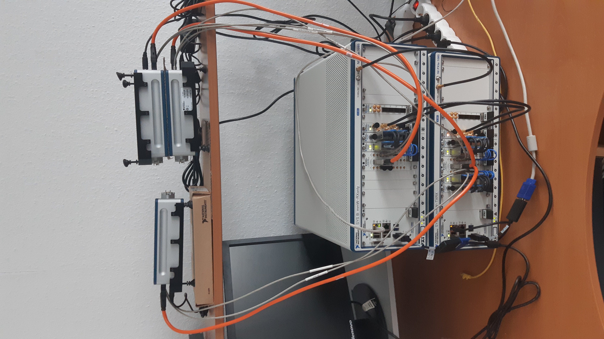
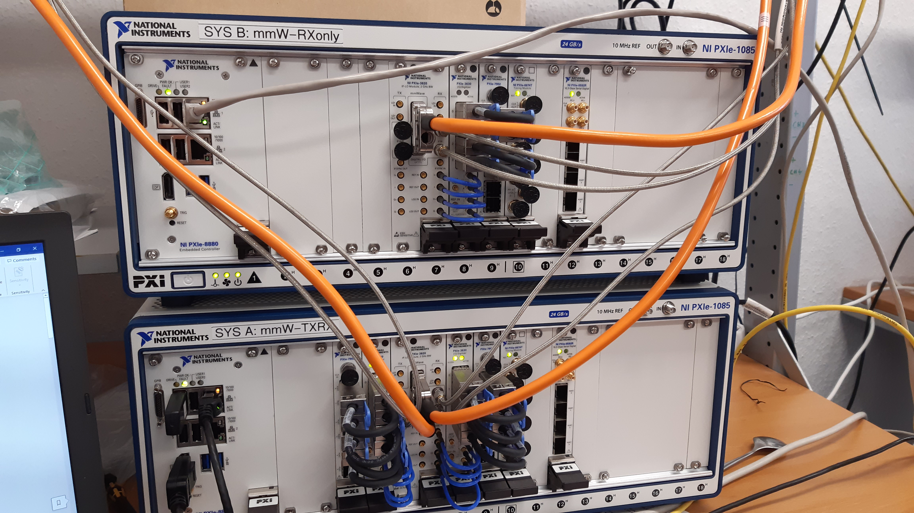
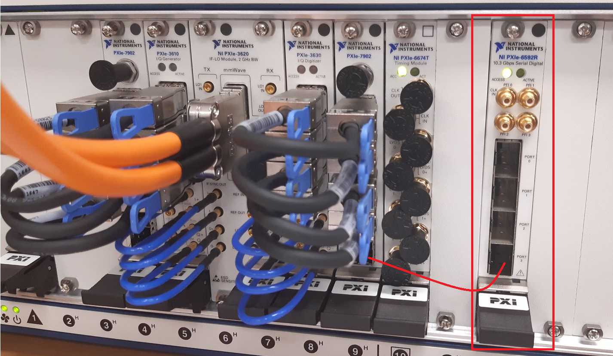
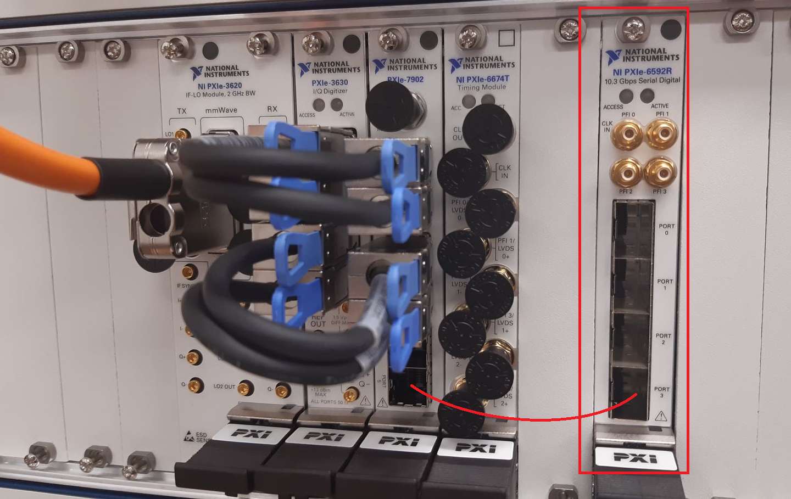
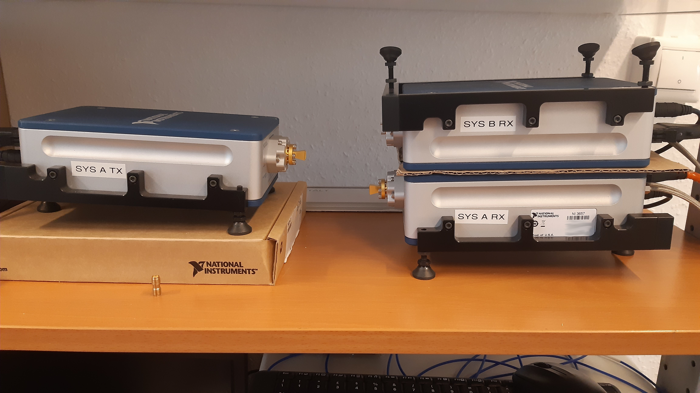

# 75GHz Transceiver System for JCAS - Additional documentation

- [documentation-mmWaveSystem.pdf](documentation-mmWaveSystem.pdf) describes the system architecture, system setup and how to use it.
- [mmWave Transceiver System specifications.pdf](mmWave Transceiver System specifications.pdf) describes specifications in coarse terms of the employed hardware.
- [Benchmarks-1.pdf](Benchmarks-1.pdf) describes some timing benchmarks that were run with the system.

The overall system fully setup

Cabling of the PXI systems.

Close-up of the cabling of System A

Close-up of the cabling of System B

Setup of the mmWave Radio Heads

